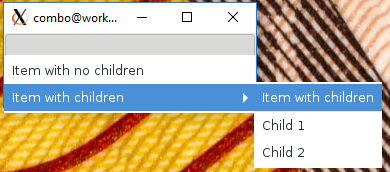
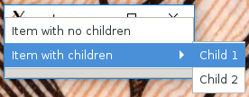

# KGtk3ComboModel

Gtk+ 3 has removed the ability to select items in a GtkComboBox that have children. In Gtk+ 2 an extra item was added to the combos, allowing the parent item to be selected:



But in Gtk+ 3 those items were removed, making it impossible to select "Item with children":



(See also [this bug report](https://gitlab.gnome.org/GNOME/gtk/issues/1229))

This package provides a work-around to restore the old functionality.


## Installation

You can clone the repository and then do the standard

```sh
./autogen.sh
./configure
make
make install
```

to build and install a shared library, then link your application to the library.

Or just copy `kgtk3-combo-model.h`, `kgtk3-combo-model.c`, `kgtk3-combo-box.h`, `kgtk3-combo-box.c` to your application and use it directly.


## Usage: KGtk3ComboBox

You can just replace existing uses of `GtkComboBox` with `KGtk3ComboBox`:

```c
GtkWidget *combo = kgtk3_combo_box_new_with_model(model);
```

and use it normally. The new combo will include extra itens corresponding to the parent item and a separator.

Since it's a subclass of GtkComboBox, all methods of GtkComboBox still work, but if you need to set the model, use `kgtk3_combo_box_set_model()`.

Note that the model used by the combo is not the model supplied in the constructor or with `kgtk3_combo_box_set_model()`, but a `KGtk3ComboModel` (see below). For basic operations such as getting data from the current iter, using the original model should work. But if you want to do other operations (such as moving the iter around), you should get the wrapped model (use the standard `gtk_combo_box_get_model()` function) and use that instead of the original model.

For a complete example, see (src/example-combo.c)


## Usage: KGtk3ComboModel

If necessary, you can wrap the model manually. First, wrap your `GtkTreeModel` in `KGtk3ComboModel` with

```c
GtkTreeModel *wrapped_model = GTK_TREE_MODEL(kgtk3_combo_model_new(model));
```

and use `wrapped_model` in a regular combo. The wrapped model will include extra itens corresponding to the parent item and a separator.

An extra boolean column is added after all the columns of the base model. This column is `TRUE` for the separator items, and should be used in a row separator function, something like this:

```c
gboolean is_separator(GtkTreeModel *model, GtkTreeIter *iter, gpointer data)
{
  gint sep_col = kgtk3_combo_model_get_separator_column(KGTK3_COMBO_MODEL(model));
  gboolean is_sep;
  gtk_tree_model_get(model, iter, sep_col, &is_sep, -1);
  return is_sep;
}

...

gtk_combo_box_set_row_separator_func(GTK_COMBO_BOX(combo),
                                     is_separator, NULL, NULL);
```

For a complete example, see (src/example-model.c)


## Perl binding

The [perl/](perl) subdirectory includes bindings allowing `KGtk3ComboModel` to be used in Perl programs.
